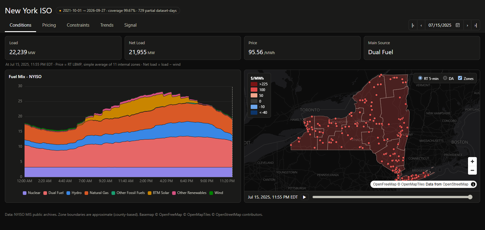
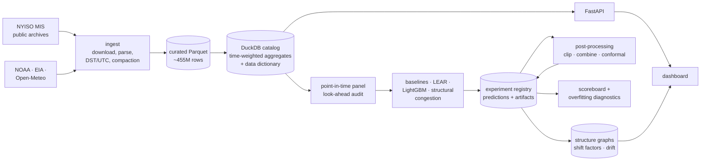
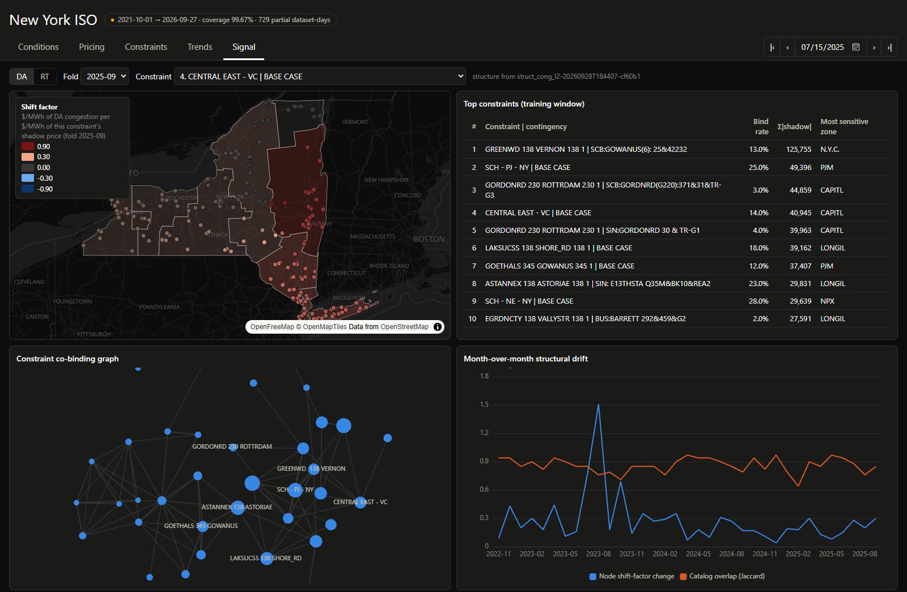
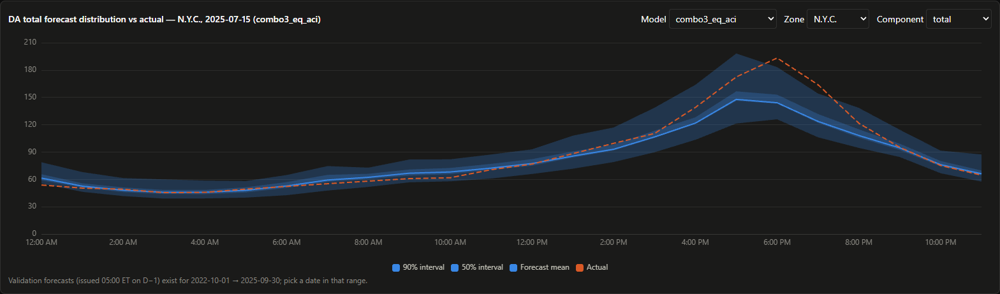

# NYISO LMP Forecasting Signal

[](https://github.com/vincal848/nyiso-grid/actions/workflows/tests.yml)

An end-to-end research system for the New York electricity market. It ingests five years of public
NYISO market data into a local warehouse, serves a live-style market dashboard, and produces
**probabilistic day-ahead (DA) and real-time (RT) price forecasts** by zone. Each forecast is
decomposed into energy, loss and congestion, and all of it is validated with look-ahead-free
time-block cross-validation and backtest-overfitting diagnostics.

The forecasts are meant to feed DART (virtual bidding) and TCC (NYISO's financial transmission rights)
pricing. Those pricers are the next phase; this repository builds and validates the signal they need.



## At a glance

| | |
|---|---|
| **Data** | ~455M rows of NYISO MIS data (Oct 2021 → Sep 2026) in Parquet + DuckDB: DA/RT prices for 15 zones and ~750 nodes, load and load forecasts, fuel mix, binding constraints, interface flows, reserve prices, transmission outage schedules; plus NOAA weather, GFS forecast vintages and Henry Hub gas |
| **Forecast** | Hourly DA and RT prices for day D, issued 05:00 ET on D−1 (the DAM bid deadline), with 21 quantiles per hour and zone |
| **Validation** | 36 monthly rolling-origin folds (Oct 2022 → Sep 2025), 7-day embargo, 12-month holdout locked in code, every trial logged |
| **Stack** | Python, DuckDB, Parquet, pandas, scikit-learn, LightGBM, FastAPI, MapLibre, ECharts, GitHub Actions |

## Results (validation, 36 out-of-sample months)

Best model: LEAR (LASSO-estimated autoregression, Lago et al. 2021) averaged with LightGBM, with
adaptive conformal intervals. Benchmark: yesterday's DA price at the same hour, which is harder to beat
in NYISO than the literature's standard naive.

| Total price, $/MWh | DA: model | DA: benchmark | RT: model | RT: benchmark |
|---|---|---|---|---|
| CRPS (full distribution) | **4.43** | 6.51 | **10.75** | 12.16 |
| RMSE (conditional mean) | **11.89** | 17.42 | **50.20** | 51.09 |
| MAE | **5.59** | 7.97 | **13.07** | 14.84 |

- **DA:** error is about 30% lower than the benchmark on every metric. The edge holds across validation
  months and is highly significant (Diebold–Mariano, HAC).
- **RT:** a smaller edge (−12% CRPS). RMSE is nearly flat because a few price spikes dominate squared error.
- **Calibration:** after adaptive conformal calibration, 90% prediction intervals miss 9.8–10.0% of
  outcomes (nominal 10%). 98% intervals still miss 2.7–3.2% (nominal 2%), and misses cluster in time;
  this tail gap is targeted next.
- **Congestion is the hard part.** Models beat persistence on DA congestion (CRPS 2.74 vs 3.18), but on
  RT congestion an always-zero forecast is a strong benchmark. This led to switching the primary metrics
  away from MAE (see *Decisions* below).

The full scoreboard, including overfitting diagnostics, is in
[docs/experiments/scoreboard.md](docs/experiments/scoreboard.md).

## How it works



**1. Warehouse.** A dataset registry drives download, parsing and storage for 17 NYISO feeds plus weather and gas sources. Raw archives
are cached and immutable, and curated Parquet is fully rebuildable from them. A data dictionary is the
single source of truth for every column's meaning, units and publication time; tests fail if the schema
drifts from it.

**2. Point-in-time panel.** One row per delivery hour and zone. Every feature block records the latest
publication time of the data it used, and the build fails if anything post-dates the 05:00 ET issue time.

**3. Models.**
- Naive benchmarks.
- LEAR: per-hour LASSO on 24-hour price lags plus load, weather and gas, with asinh variance
  stabilization and calibration-window averaging.
- Pooled LightGBM.
- A **structural congestion model**. It estimates each node's sensitivity to each transmission
  constraint (shift factors) from prices alone, forecasts per constraint whether it binds and at what
  shadow price, and maps that to zones and nodes.

**4. Post-processing without refits.** Clipping, window selection, cross-model combination and
adaptive conformal intervals run on stored out-of-sample predictions in seconds to minutes, each logged
as its own trial.

**5. Honest evaluation.** A registry logs every run, including failed and exploratory ones, with config,
code and data fingerprints. The scoreboard reports CRPS/RMSE/MAE, DM tests, interval-coverage tests,
and López de Prado-style overfitting diagnostics: Deflated Sharpe Ratio, PBO via CSCV, and Hansen's SPA
test with multiple-testing adjustments. All are computed on daily forecast skill.

## Engineering highlights

- **Reproducing the ISO to the cent.** About 4% of NYISO real-time dispatch intervals are not 5 minutes
  long. Rebuilding each interval's true length and time-weighting reproduces NYISO's published hourly
  real-time prices to the cent in every hour from 2021 through 2024.
- **A DST bug found by validation.** The time-weighting check exposed off-grid timestamps in the repeated
  fall-back hour that a "first occurrence = daylight time" rule misassigns. The parser now resolves DST
  by file order, with a regression test built from the real 2021-11-07 file.
- **A look-ahead trap avoided.** A NYISO load-forecast file is only usable from about 08:30 ET on its
  file date, *after* the 05:00 ET issue time, so naively joining the D−1 file would leak future information
  into every backtest row. Publication times are modelled explicitly per source and audited at build time.
- **Network structure learned from prices.** The top 60 constraints explain a median 92–93% of each
  node's congestion. A drift monitor flags structural breaks, such as a near-complete rotation of the
  congestion subspace in Aug 2023.
- **Fit once, post-process many times.** Fixes that would have meant hour-long refits (clipping
  exploding LEAR forecasts, window selection, model combination, conformal intervals) run on stored
  predictions in seconds to minutes. Reports read a per-run daily-loss cache, so scoring stays fast as
  the number of logged trials grows.



*Signal tab. Node and zone sensitivity to the Central East interface: congestion there raises prices
downstream, and the model learned this from price data alone. Also shown: the constraint co-binding
graph and month-over-month structural drift.*



*Forecast distribution (50% and 90% bands) vs the realized DA price, NYC, 2025-07-15.*

## Decisions (and why)

- **CRPS and RMSE as primary metrics, MAE secondary.** MAE rewards the median. Congestion is roughly zero
  in 73% of RT hours, so an always-zero forecast "wins" on MAE while being useless for trading, where
  P&L is linear in price.
- **Structure before deep learning.** A literature and industry review ([docs/research](docs/research/lmp_forecasting_model_landscape.md))
  found strong evidence for ensembles of domain models with calibrated post-processing. It found weak
  real-market evidence for graph neural nets and zero-shot foundation models, so those are deferred.
- **Every trial counts.** Deflated Sharpe and PBO are only meaningful if nothing is hidden, so failed,
  aborted and exploratory runs stay in the registry.

## Quick start

```bash
uv sync --extra dev
uv run nyiso backfill && uv run nyiso external && uv run nyiso reference && uv run nyiso build
uv run lmp panel && uv run lmp baselines && uv run lmp train lear && uv run lmp report
uv run nyiso serve                    # dashboard at http://127.0.0.1:8000
uv run pytest                         # data-dependent tests skip without the local warehouse
```

The backfill downloads about 7 GB of public data. Everything under `data/` is git-ignored and rebuildable.

## Repository guide

| Path | Contents |
|---|---|
| `src/nyiso/` | Warehouse: dataset registry, ingest, storage and aggregates, data dictionary, API |
| `web/` | Dashboard (Conditions, Pricing, Constraints, Trends, Signal) |
| `pipeline/lmpsignal/` | Forecasting signal: panel, CV, models, post-processing, diagnostics, registry, reports |
| `docs/DATA.md` | Every table and column, units, gaps and conventions |
| `docs/FEATURES.md` | Forecasting panel features and their publication times |
| `docs/STRUCTURE.md` | Stored model internals and the structure graph store |
| `docs/ROADMAP.md` | Milestones and what comes next |
| `docs/research/` | Literature and industry review with source notes |
| `CLAUDE.md` | Working rules for AI coding agents used on the project |

## Roadmap

Done: warehouse and dashboard; M0 data audit; M1 validation harness; M2 statistical models; M2.5
post-processing; M3 structural congestion (first version).

Next:
- Map outages to constraints for congestion.
- An RT spike model (occurrence plus magnitude tied to NYISO's reserve shortage pricing).
- Distributional calibration with extreme-value tails and joint DA/RT scenarios.
- Horizon extension toward monthly curve products.
- The final holdout evaluation.

After that come the DART and TCC pricers.

## Data and licensing notes

- NYISO MIS, NOAA and EIA data are public.
- Weather forecast vintages come from Open-Meteo's free, non-commercial API and are used for research
  only. A licensed source would replace them for live use.
- Zone boundaries are approximate (county-based).
